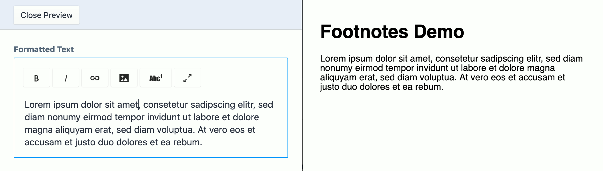
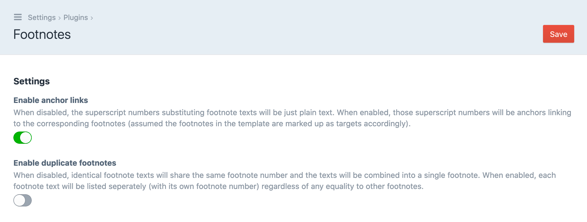
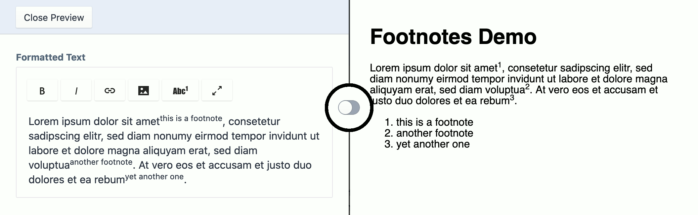
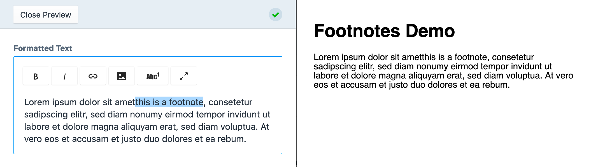

# Craft Footnotes
This Craft CMS plugin enables you to **define footnotes for your website** contents.



The plugin adds a footnote button to Redactor fields (aka RichtText or WYSIWYG). Marked parts of your text content will be said to act as footnotes after clicking the button.

Also, it adds new filters and functions to your Twig templates that help you handling with the footnotes.

## Installation
You can install Footnotes via the plugin store, or through Composer.

### Craft Plugin Store
To install **Footnotes**, navigate to the _Plugin Store_ section of your Craft control panel, search for `Footnotes`, and click the _Try_ button.

### Composer
You can also add the package to your project using Composer.

1. Open your terminal and go to your Craft project:

        cd /path/to/project

2. Then tell Composer to load the plugin:
    
        composer require verbb/footnotes

3. In the Control Panel, go to Settings → Plugins and click the “Install” button for Footnotes.

### Settings
You may now go to the plugin's settings page and activate the described features.



In the following you can get an impression of what happens when toggling these setting lightswitches.

#### Enable anchor links


If the plugin is already in use, please have in mind, that when toggling this setting you need to make some minor changes in your Twig templates as well to make the anchor links work. Unfortunately not everything is just magic.  
&rarr; See the [Render all collected footnotes](#render-all-collected-footnotes) section below for how to implement your Twig templates.

#### Enable duplicate footnotes


Have a look at *"this is a footnote"* in particular to see what happens on activating the feature in the settings page.

## Usage

### Usage for Developers

#### Add the footnote button to the Redactor field
You need to edit the used Redactor configs unless you want the content editor to manually type HTML tags when editing sections and creating entries.

Lucky us, this is pretty easy.

Let's have a look at the `Standard` Redactor config (which is located at _./config/redactor/Standard.json_).

```json
{
	"buttons": ["format","bold","italic","lists","link","file","horizontalrule"],
	"plugins": ["source","fullscreen"]
}
```

You only have to add `footnotebutton` to Redactor plugins. This is how the config file looks afterwards.


```json
{
	"buttons": ["format","bold","italic","lists","link","file","horizontalrule"],
	"plugins": ["source","fullscreen","footnotebutton"]
}
```

Here the same thing for the `Simple` Redactor config (_./config/redactor/Simple.json_) if you use that instead.

Before:

```json
{
	"buttons": ["bold","italic"]
}
```

After:


```json
{
	"buttons": ["bold","italic"],
	"plugins": ["footnotebutton"]
}
```

Feel free to add the `footnotebutton` plugin to any other Redactor config as well.

#### Collect all footnotes and replace with numbers
You have nothing more to do than invoking the `footnotes` filter that comes with this plugin.

```twig
{# when accessing Redactor fields in your Twig template use the new filter #}
{{ entry.handle_of_redactorfield | footnotes }}
```

The filter also works on string values containing HTML.

```twig
{{ '<p>My awsome content is indeed awesome.<sup class="footnote">How can\'t it be?</sup></p>' | footnotes }}
```

What happens here? Each substring surrounded by `<sup>` tags having the `class` attribute set to `footnote` will be replaced with a number, the sequence begins with 1.

Therefore the rendered string will be:

```html
<p>My awsome content is indeed awesome.<sup id="fnref:1">1</sup></p>
```

#### Render all collected footnotes
The plugin provides you with the new Twig function `footnotes()`. It returns an array of footnotes (those that have been collected using the `footnotes` filter mentioned above). Each footnote is indexed by its `number`.

```twig

<ul>
	
		<li>{{ number }} {{ footnote }}</li>
	
</ul>

```

##### If anchor links are enabled
When activating the [Enable anchor links](#enable-anchor-links) option on the plugin's settings page, the `number` variable will contain a link like `<a href="#footnote-1">1</a>`. You can get the plain footnote number with [Twig’s `loop` variable](https://twig.symfony.com/doc/2.x/tags/for.html) for usage in the `<li>` element's `id` attribute:

```twig

<ul>
	
		<li id="footnote-{{ loop.index }}">
			{{ number | raw }} {{ footnote }}
		</li>
	
</ul>

```

Don't forget to use the `raw` filter for printing the `number` because it contains some HTML now.

##### Optionally add a back button
From there, you might want to add a link that jumps readers back to their position they just came from. Each footnote reference in your text content already comes with an ID, e.g. `fnref:1`, so you can link back to that ID from your footnote.

```twig

<ul>
	
		<li id="footnote-{{ loop.index }}">
			{{ number | raw }} {{ footnote }}
			<a href="#fnref:{{ loop.index }}">back</a>
		</li>
	
</ul>

```

### Usage for editors
Write your footnote text directly into the Redactor field and mark it.



Click the **Footnote** button [x<sup>2</sup>].


Here we go…


Nothing more to do. You successfully created a footnote.

Do not forget to save the entry. ;)

### TL;DR
1. add `footnotebutton` plugin to redactor config
2. mark some of your text contents as footnotes by using the new button
3. use `footnotes` filter in Twig templates to collect all footnotes and replace them with sequential numbers
4. iterate and output each footnote by calling `footnotes()` function in Twig template

## Credits
Originally created by the team at [Vierbeuter](http://www.vierbeuter.de/).

## Show your Support
Footnotes is licensed under the MIT license, meaning it will always be free and open source – we love free stuff! If you'd like to show your support to the plugin regardless, [Sponsor](https://github.com/sponsors/verbb) development.

<h2></h2>

<a href="https://verbb.io" target="_blank">
    
</a>
