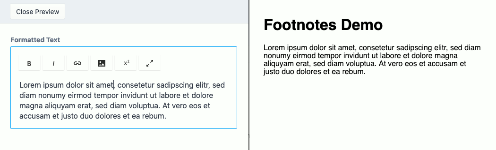
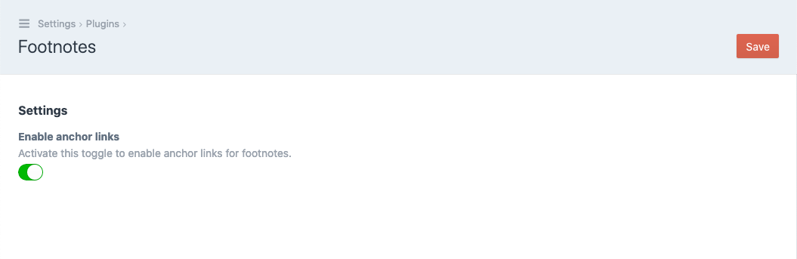
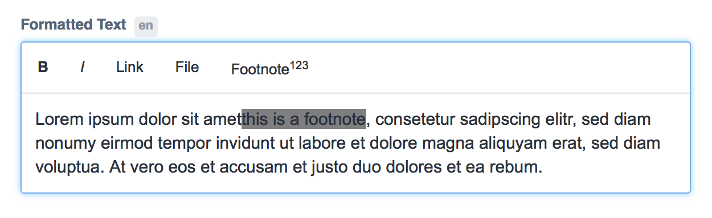
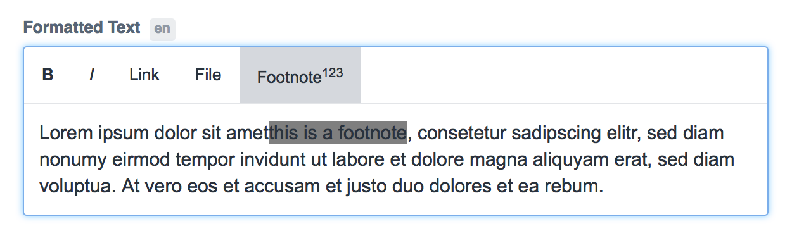

# Craft Footnotes

You can find here a footnotes plugin for Craft CMS 3.

*… Looking for the Craft CMS 2 footnotes plugin? – Get the [1.1.3 release](https://github.com/Vierbeuter/craft-footnotes/tree/1.1.3).*

## Contents

* [About](#about)
* [Disclaimer](#disclaimer)
* [Install](#install)
* [Usage](#usage)
	* [TL;DR](#tldr)
	* [Usage for Developers](#usage-for-developers)
	* [Usage for editors](#usage-for-editors)
* [License](#license)

## About

This Craft CMS plugin enables you to **define footnotes for your website** contents.



The plugin adds a footnote button to Redactor fields (aka RichtText or WYSIWYG). Marked parts of your text content will be said to act as footnotes after clicking the button.
Also, it adds new filters and functions to your Twig templates that help you handling with the footnotes.

⬆️ [back to top](#contents)

## Disclaimer

This plugin is by far not perfect. It's intentionally held simple. If you want a more or less fail-safe, fancy, super-cool Swiss army Craft plugin feel free to fork it and make changes as you need them.

Also, lots of translations are missing (see TODO in [footnotebutton.js](./src/assetbundles/redactor/dist/footnotebutton.js) for details). Any pull requests are welcome.

⬆️ [back to top](#contents)

## Install

Just load the PHP package using Composer:

```bash
composer require vierbeuter/craft-footnotes
```

Now, log in to your Craft project's admin panel, head to plugin settings (*&lt;yourdomain.tld&gt;/admin/settings/plugins*) and install/activate the Footnotes plugin.

👍 That's it.

You may now go to the plugin's settings page and activate the `enableAnchorLinks` option unless you want the plugin to just print non-clickable numbers for the footnotes.



⬆️ [back to top](#contents)

## Usage

### TL;DR

1. add `footnotebutton` plugin to redactor config
2. mark some of your text contents as footnotes by using the new button
3. use `footnotes` filter in Twig templates to collect all footnotes and replace them with sequential numbers
4. iterate and output each footnote by calling `footnotes()` function in Twig template

⬆️ [back to top](#contents)

### Usage for Developers

#### Add the footnote button to the Redactor field

You need to edit the used Redactor configs unless you want the content editor to manually type HTML tags when editing sections and creating entries.

Lucky us, this is pretty easy.

Let's have a look at the `Standard` Redactor config (which is located at _./config/redactor/Standard.json_).

```json
{
	"buttons": ["format","bold","italic","lists","link","file","horizontalrule"],
	"plugins": ["source","fullscreen"]
}
```

You only have to add `footnotebutton` to Redactor plugins. This is how the config file looks afterwards.


```json
{
	"buttons": ["format","bold","italic","lists","link","file","horizontalrule"],
	"plugins": ["source","fullscreen","footnotebutton"]
}
```

Here the same thing for the `Simple` Redactor config (_./config/redactor/Simple.json_) if you use that instead.

Before:

```json
{
	"buttons": ["bold","italic"]
}
```

After:


```json
{
	"buttons": ["bold","italic"],
	"plugins": ["footnotebutton"]
}
```

Feel free to add the `footnotebutton` plugin to any other Redactor config as well.

#### Collect all footnotes and replace with numbers

You have nothing more to do than invoking the `footnotes` filter that comes with this plugin.

```twig
{# when accessing Redactor fields in your Twig template use the new filter #}
{{ entry.handle_of_redactorfield | footnotes }}
```

The filter also works on string values containing HTML.

```twig
{{ '<p>My awsome content is indeed awesome.<sup>How can\'t it be?</sup></p>' | footnotes }}
```

What happens here? Each substring surrounded by `<sup>` tags will be replaced with a number, the sequence begins with 1.

Therefore the rendered string will be:

```html
<p>My awsome content is indeed awesome.<sup id="fnref:1">1</sup></p>
```

#### Render all collected footnotes

The plugin provides you with the new Twig function `footnotes()`. It returns an array whose string entries (those that has been collected on usage of the `footnotes` filter mentioned above) are indexed by the number of the footnote.

```twig

<ul>
	
		<li>{{ number }} {{ footnote }}</li>
	
</ul>

```

When activating the `enableAnchorLinks` option on the plugin's settings page, you can get the footnote number without formatting via [Twig’s `loop` variable](https://twig.symfony.com/doc/2.x/tags/for.html):

```twig

<ol>
	
		<li id="footnote-{{ loop.index }}">
			{{ footnote }}
		</li>
	
</ol>

```

From there, you might want to add a link that jumps readers back to their position, too. Each rendered string with `<sup>` has an ID prefix with `fnref:`, ex. `fnref:1`, so you can link back to that ID from your footnote.

```twig

<ol>
	
		<li id="footnote-{{ loop.index }}">
			{{ number | raw }} {{ footnote }}
			<a href="#fnref:{{ loop.index }}">back</a>
		</li>
	
</ol>

```

⬆️ [back to top](#contents)

### Usage for editors

Write your footnote text directly into the Redactor field and mark it.



Click the **Footnote** button [x<sup>2</sup>].



Here we go…


Nothing more to do. You successfully created a footnote.

Do not forget to save the entry. ;)

⬆️ [back to top](#contents)

## License

This library is licensed under the terms of the **MIT license**. See also the project's [license file](./LICENSE).

⬆️ [back to top](#contents)
