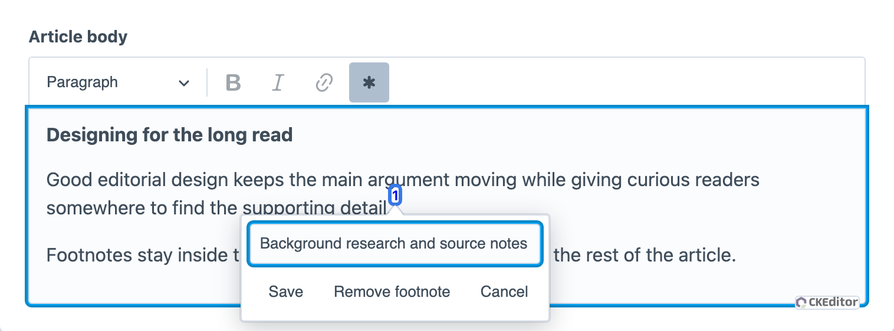

<!-- feature-intro -->
Footnotes gives CKEditor authors a deliberate way to add supporting notes without interrupting the main text. Mark the note in the editor and render an ordered, linked footnote list through Twig.
<!-- feature-intro-end -->

<!-- feature-section media-size="large" media-shadow="false" -->
## Better long-form reading

Authors can identify text as a footnote from the CKEditor toolbar instead of hand-writing anchors or HTML. The content remains part of the rich-text workflow while the published page can separate supporting detail from the main passage.

<!-- feature-section-end -->

<!-- feature-section -->
## Flexible rendering

Twig helpers process footnote markers into linked references and a corresponding list. Scoped anchors prevent collisions when a page renders several bodies of rich text, while developers retain control over attributes, return links and the surrounding template. The same structured footnote data is available through GraphQL for headless projects.
<!-- feature-section-end -->
