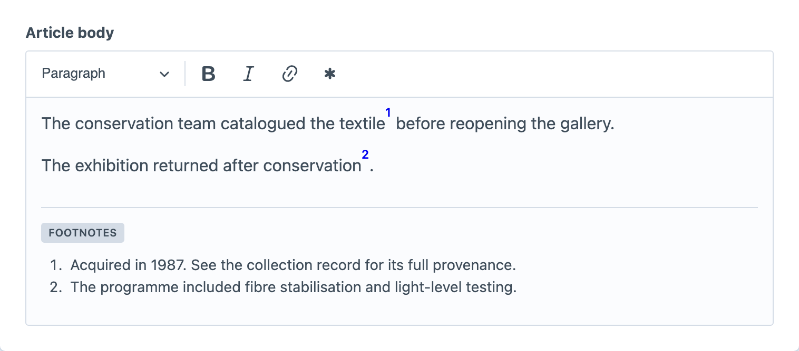

<!-- feature-intro -->
Footnotes lets CKEditor authors write rich supporting notes without leaving the document, while keeping the published result accessible and ready to render.
<!-- feature-intro-end -->

<!-- feature-media media-shadow="false" -->
## Give every note room to breathe

A citation rarely fits comfortably inside a small popover. Footnotes puts definitions in an editable region at the end of the same CKEditor document, where authors can use paragraphs, links, inline formatting and simple lists with the editor controls they already know.

References and definitions stay connected as content moves. Reuse one definition from several places, paste a rich note into another field as an independent copy, or remove the last reference and its definition together through the normal undo history.

<!-- feature-media-end -->

<!-- feature-grid -->
- :icon[file-description] **Complete field output** Saved CKEditor HTML includes references, definitions and return links, ready for ordinary field rendering.
- :icon[brackets-contain] **Reference styles** Present in-text markers as compact numbers or familiar Wikipedia-style square-bracketed numbers.
- :icon[accessible] **Accessible navigation** Labels, linked targets and backlinks give each reference a clear destination.
- :icon[braces] **Twig flexibility** Move or combine notes from one or several fields, then use the default list or your own markup.
- :icon[api] **GraphQL data** Headless clients can request plain text, rich HTML and every repeated reference target.
<!-- feature-grid-end -->

<!-- feature-section -->
## Fit footnotes around the page

Render a field directly when the note list belongs with its article. When a layout needs the definitions elsewhere, Twig can move or combine notes from one or several fields while keeping predictable numbering. Use the standard list or take complete control over its markup.
<!-- feature-section-end -->
